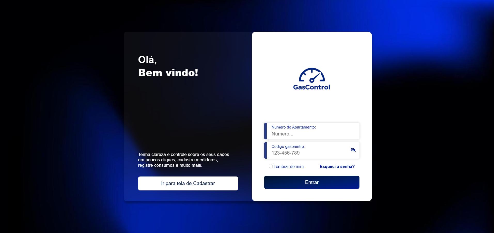
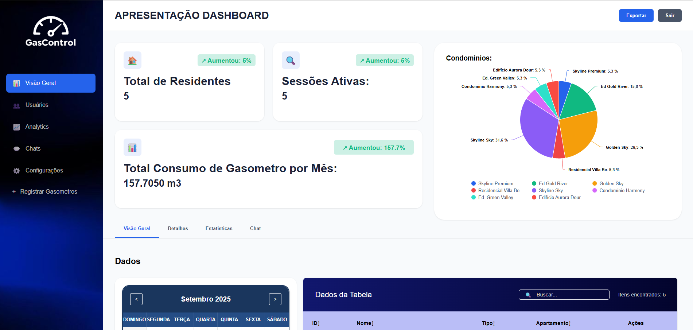

# Gas Control Frontend

Este é o repositório do frontend do projeto **Gas Control**, uma aplicação para gerenciamento de consumo de gás em condomínios. O projeto foi desenvolvido utilizando **React**, **TypeScript**, **Vite** e **Sass**, com suporte a gráficos interativos e uma interface moderna.

## Índice

- [Visão Geral](#visão-geral)
- [Funcionalidades](#funcionalidades)
- [Estrutura do Projeto](#estrutura-do-projeto)
- [Tecnologias Utilizadas](#tecnologias-utilizadas)
- [Instalação e Configuração](#instalação-e-configuração)
- [Scripts Disponíveis](#scripts-disponíveis)
- [Contribuição](#contribuição)
- [Licença](#licença)

---

## Visão Geral

O **Gas Control** é uma aplicação que permite:

- Gerenciar usuários e apartamentos.
- Registrar e monitorar leituras de consumo de gás.
- Visualizar gráficos e métricas de consumo.
- Navegar por diferentes seções, como cadastro, dashboards e chats.

## Design

Tela de Login: 


Tela de Cadastro: 


Dashboard: 


## Funcionalidades

- **Autenticação**: Login e cadastro de usuários.
- **Dashboard**: Exibição de métricas e gráficos interativos.
- **Registro de Leituras**: Cadastro de leituras de consumo de gás.
- **Tabela de Dados**: Exibição de informações em tabelas paginadas e ordenáveis.
- **Gráficos**: Gráficos de linha, barra, pizza e área utilizando Highcharts.
- **Chat**: Sistema de chat para suporte e comunicação interna.
- **Design Responsivo**: Interface adaptada para diferentes tamanhos de tela.

## Estrutura do Projeto

A estrutura do projeto é organizada da seguinte forma:

## Tecnologias Utilizadas

- **React**: Biblioteca para construção de interfaces de usuário.
- **TypeScript**: Superset do JavaScript para tipagem estática.
- **Vite**: Ferramenta de build rápida para desenvolvimento.
- **Sass**: Pré-processador CSS para estilos mais organizados.
- **Highcharts**: Biblioteca para gráficos interativos.
- **Axios**: Cliente HTTP para comunicação com APIs.
- **React Router**: Gerenciamento de rotas.

## Instalação e Configuração

### Pré-requisitos

Certifique-se de ter o **Node.js** (versão 16 ou superior) e o **npm** instalados em sua máquina.

### Passos

1. Clone o repositório:

   ```bash
   git clone https://github.com/seu-usuario/gascontrol-frontend.git
   cd gascontrol-frontend
   ```

2. Instale as dependências:

```bash
npm install
```

3. Inicie o servidor de desenvolvimento:
```bash
npm run dev
```

4. Acesse a aplicação no navegador: 


### Scripts Disponíveis

- npm run dev: Inicia o servidor de desenvolvimento.
- npm run build: Gera a build de produção.
- npm run preview: Visualiza a build de produção.
- npm run lint: Executa o linter para verificar problemas no código.

| Faça um fork do repositório.